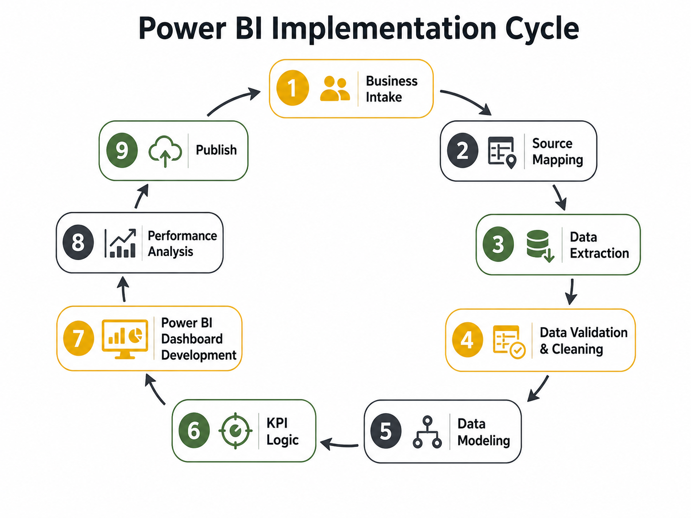
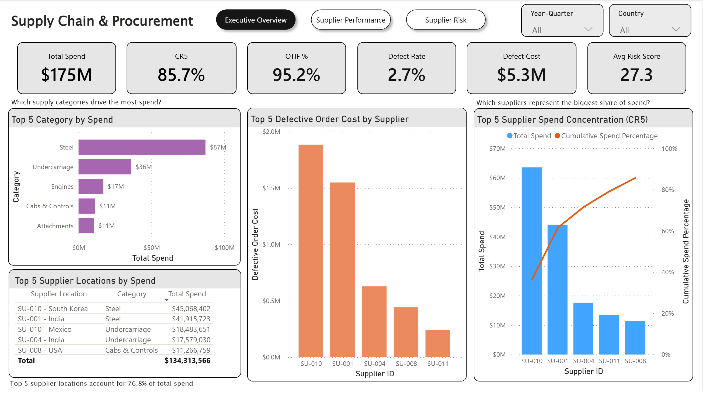
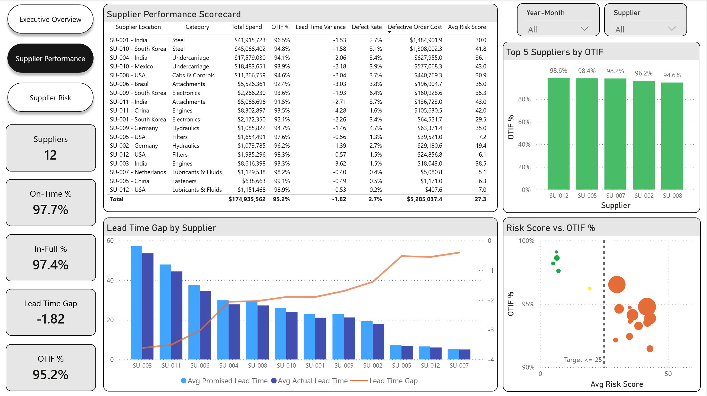
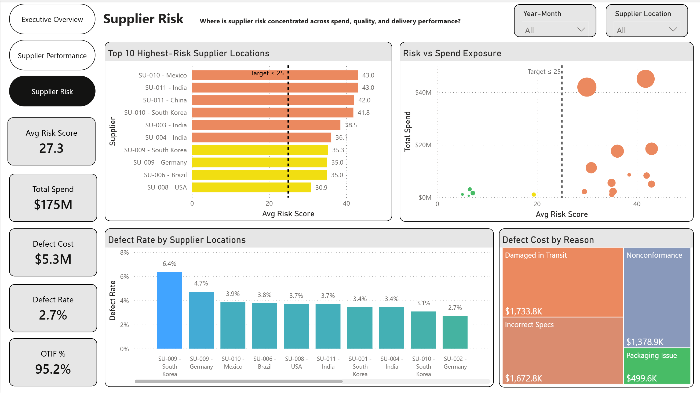
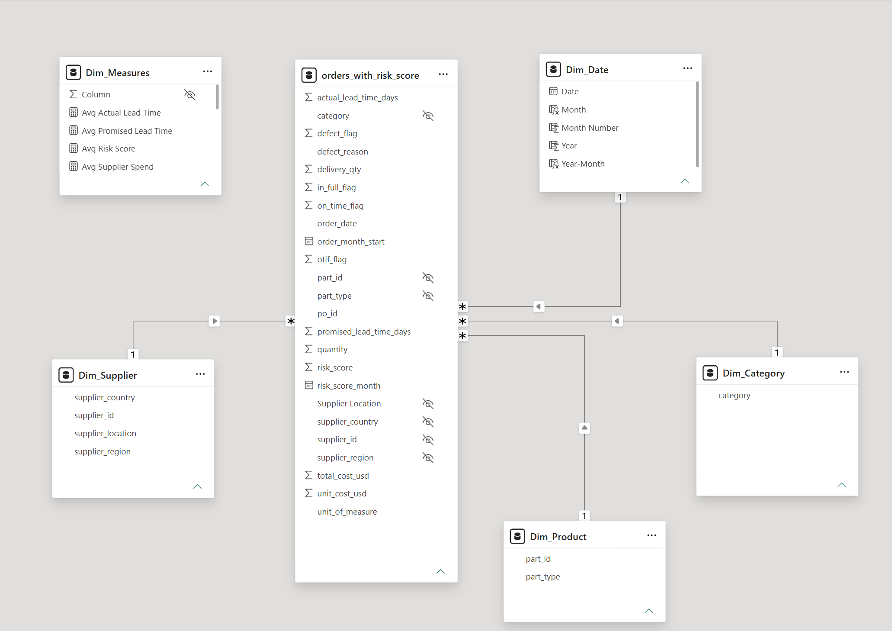
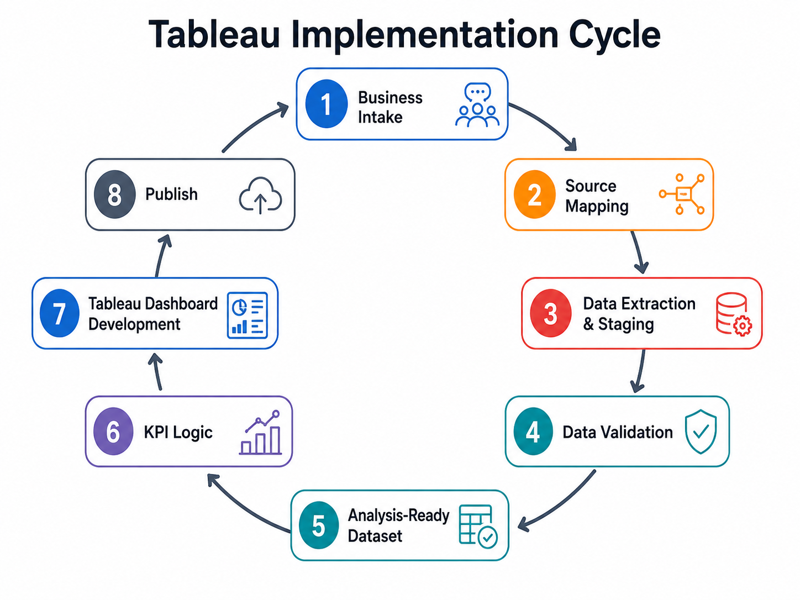
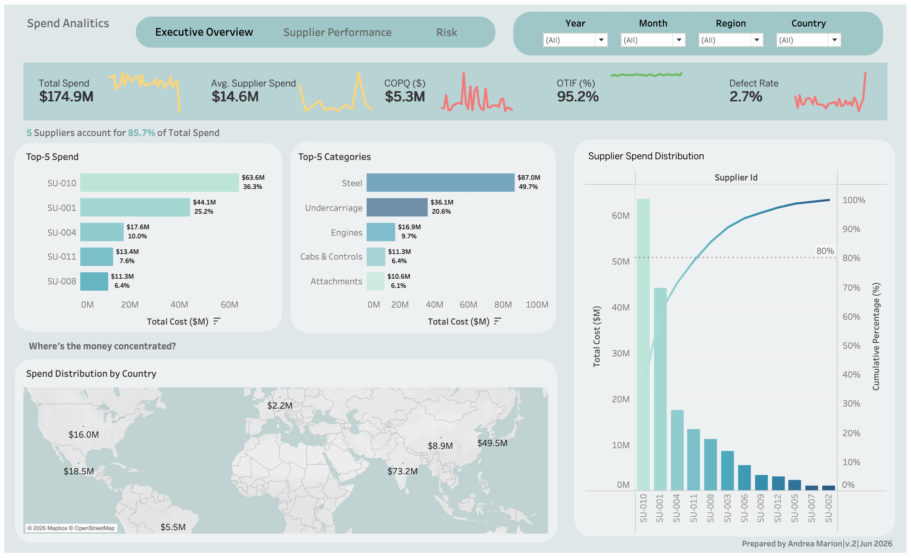

# Supply Chain & Procurement Intelligence

## Overview

This is a cross-platform BI portfolio project focused on supplier performance, procurement spend, delivery reliability, quality, supplier concentration, and supplier risk.

The project uses synthetic procurement data generated with Python. The business logic and reporting structure were designed to reflect realistic procurement and operations scenarios involving purchase orders, supplier lead times, delivery performance, defects, spend exposure, and monthly supplier risk scoring.

The same business problem is implemented in both **Power BI** and **Tableau**, but the two implementations are not exact visual or technical copies. Each version reflects a different BI development workflow and platform architecture.

---

## Live Dashboards

- [View the interactive Power BI dashboard](https://app.powerbi.com/view?r=eyJrIjoiYmQ2YzE4ODctYzY2OS00Njg4LWExMDMtNjlhMGUzMTY2MzM5IiwidCI6IjRmMWUwNDRkLTNkNzAtNDk5MC1iMjZhLWI5NWYwYzY0MmUxYSIsImMiOjR9)
- [View the Tableau dashboard](https://public.tableau.com/shared/Z34PMC76K?:display_count=n&:origin=viz_share_link)

> **Tableau status:** The Tableau implementation is still being completed. The live link and final findings will be added once the remaining report pages are finalized and published.

---

## Business Problem

Procurement teams and operations leaders need visibility into:

- Where procurement spend is concentrated
- Which suppliers represent the largest share of spend
- Which supplier locations create the greatest operational or sourcing exposure
- Whether suppliers meet delivery commitments
- Where defects are creating cost exposure
- Whether higher-risk suppliers or supplier locations also show weaker delivery performance
- How supplier concentration may increase procurement dependency

The reports were designed to support supplier and procurement performance reviews using both supplier-level and supplier-location-level analysis.

---

## Project Objectives

- Analyze supplier and supplier-location performance
- Measure OTIF, on-time delivery, in-full delivery, defects, lead-time performance, spend concentration, and risk
- Identify supplier concentration using CR5
- Compare supplier risk with spend exposure and delivery performance
- Distinguish supplier-level performance from supplier-location-level operational differences
- Demonstrate the same business problem through two BI platforms using different technical workflows

---

## Dataset

The project uses simulated procurement data generated with Python.

### Data generation files

- `01_data_simulation.ipynb`
- `risk_scores.py`

### `01_data_simulation.ipynb`

Used to simulate the original procurement dataset, including:

- Heavy-equipment component categories
- Part types and units of measure
- Supplier profiles
- Supplier countries and regions
- Purchase-order records
- Lead-time behavior
- On-time and in-full delivery indicators
- Defect flags and defect reasons
- Unit and total cost calculations

### `risk_scores.py`

Used to generate supplier risk-scoring logic and monthly supplier risk data.

---

## Main Dataset Fields

| Field | Description |
| --- | --- |
| `order_date` | Date when the purchase order was placed |
| `po_id` | Unique purchase-order identifier |
| `supplier_id` | Unique supplier identifier |
| `supplier_region` | Geographic region of the supplier |
| `supplier_country` | Supplier sourcing location / country |
| `part_id` | Unique part identifier |
| `part_type` | Type of heavy-equipment part |
| `category` | Procurement category |
| `unit_of_measure` | Unit used for the order quantity |
| `quantity` | Ordered quantity |
| `delivery_qty` | Delivered quantity used for in-full analysis |
| `unit_cost_usd` | Unit cost in U.S. dollars |
| `total_cost_usd` | Total purchase-order cost |
| `promised_lead_time_days` | Agreed supplier lead time |
| `actual_lead_time_days` | Actual delivery lead time |
| `on_time_flag` | Indicates whether the order was delivered on time |
| `in_full_flag` | Indicates whether the order was delivered in full |
| `otif_flag` | On-Time, In-Full delivery indicator |
| `defect_flag` | Indicates whether a quality defect was recorded |
| `defect_reason` | Reason for defect, when applicable |
| `risk_score_month` | Month associated with the supplier risk score |
| `risk_score` | Supplier risk score used for risk monitoring |

---

## Source Files

The project uses three synthetic CSV files:

- `synthetic_procurement_orders.csv`
- `supplier_risk_scores_monthly.csv`
- `orders_with_risk_score.csv`

### 1. `synthetic_procurement_orders.csv`

The original simulated procurement dataset containing purchase-order activity, suppliers, parts, categories, quantities, costs, lead times, delivery indicators, and defect information.

### 2. `supplier_risk_scores_monthly.csv`

Contains monthly supplier risk scores used for supplier-risk monitoring and trend analysis.

### 3. `orders_with_risk_score.csv`

The enriched analysis-ready dataset created by combining procurement-order data with supplier risk information. This file is used as the master analytical source for the Tableau implementation.

> **Supplier vs. supplier location:** Some suppliers operate in more than one country. Supplier-level metrics evaluate the vendor as a whole, while supplier-location analysis is used when the business question requires identifying differences between sourcing locations.

---

## Two BI Implementations

The same business problem was implemented in both Power BI and Tableau to demonstrate cross-platform BI development.

The **Tableau version was developed first** using SQL and an analysis-ready flat dataset.

The **Power BI version was developed later** and expanded into a more structured BI workflow using Power Query, a dimensional model, reusable DAX measures, KPI targets, performance validation, and publishing through Power BI Service.

The reports are intentionally not exact copies. Each implementation reflects the design choices and technical workflow used in that platform.

---

# Power BI Implementation

## Implementation Cycle



**Workflow**

Business Intake → Source Mapping → Data Extraction → Data Validation & Cleaning → Data Modeling → KPI Logic → Power BI Dashboard Development → Performance Analysis → Publish

### Tools used in the Power BI flow

- **Python** — synthetic data generation
- **Power Query** — data extraction, preparation, staging, validation, and cleaning
- **Power BI** — dimensional modeling, relationships, report development, and publishing
- **DAX** — KPI and business-metric logic
- **Performance Analyzer** — report performance validation

---

## Power BI Report Pages

1. Executive Overview
2. Supplier Performance
3. Supplier Risk

### Business questions addressed

- Where is direct procurement spend concentrated?
- Which supply categories drive the most spend?
- Which suppliers represent the largest share of procurement spend?
- Which supplier locations represent the greatest sourcing exposure?
- How are suppliers performing against delivery expectations?
- Where are defects creating cost exposure?
- Which supplier locations exceed the internal risk target?
- Do higher-risk suppliers also show weaker delivery performance?

---

## Power BI Report Pages

### Executive Overview



### Supplier Performance



### Supplier Performance



---

## Power BI Data Model

The Power BI implementation uses `orders_with_risk_score` as the central fact table, supported by dimension tables for date, supplier, product, and category.



The model was designed as a star schema to separate descriptive business entities from transactional procurement data.

---

## Power BI Core KPIs

- Total Spend
- CR5 Supplier Concentration
- OTIF %
- On-Time %
- In-Full %
- Lead Time Gap
- Defect Rate
- Defective Order Cost
- Average Risk Score
- Risk Target Status

Detailed DAX documentation is stored in:

- [`power-bi/dax/measures.md`](power-bi/dax/measures.md)
- [`power-bi/dax/calculated-columns.md`](power-bi/dax/calculated-columns.md)

---

## Power BI Report Key Findings

### Executive Overview

- Total procurement spend was approximately **$175M**.
- The top five suppliers represented **85.7%** of total procurement spend, indicating high supplier concentration.
- The top five supplier locations represented **76.8%** of total spend.
- Overall OTIF performance was **95.2%**.
- The overall defect rate was **2.7%**.
- Approximately **$5.3M** in procurement spend was associated with orders flagged as defective.
- The average supplier risk score was **27.3**, which was **2.3 points above** the internal target of **25**.
- Supplier `SU-010`, combining its South Korea and Mexico locations, represented approximately **36.3%** of total spend.
- Steel was the largest procurement category, representing approximately **49.7%** of total spend.

### Supplier Performance

- The dataset contains **12 suppliers**, several of which operate from more than one sourcing location.
- Overall on-time delivery performance was **97.7%**.
- Overall in-full performance was **97.4%**.
- The average Lead Time Gap was **-1.82 days**. Because the measure is calculated as actual lead time minus promised lead time, the negative result indicates that orders were delivered approximately **1.82 days earlier than promised on average**.
- Based on the average risk score calculated for each supplier location, only **6 of the 17 supplier locations** met the internal target of **25 or below**.
- `SU-009` had the two highest location-level defect rates: **6.4% in South Korea** and **4.7% in Germany**.
- The highest Defective Order Cost was associated with `SU-001 - India`, at approximately **$1.48M**.
- High spend did not consistently correspond to the highest defect rates; some lower-spend supplier locations, particularly `SU-009`, recorded comparatively high defect rates.

### Supplier Risk

- Total Defective Order Cost was approximately **$5.3M**.
- Spend exposure was concentrated among a small number of supplier locations with risk scores above the internal target.
- The Risk vs. Spend Exposure scatter plot did **not show a clear overall positive linear relationship** between risk score and spend. Several higher-risk locations had relatively low spend, while a small number of locations carried particularly high spend exposure.
- `SU-009 - South Korea` had the highest defect rate at **6.4%**, with approximately **$160,929** in spend associated with defective orders and approximately **$2.27M** in total spend.
- Defective Order Cost represented approximately **7.1%** of that supplier location's spend.
- `Damaged in Transit` was associated with the highest Defective Order Cost, at approximately **$1.73M**.
- All ten supplier locations shown in the highest-risk ranking exceeded the internal target of **25**.

---

## Power BI Validation and Performance

The Power BI report was validated by comparing:

- KPI totals
- Supplier and supplier-location rankings
- Filter and slicer behavior
- Cross-visual interactions
- Aggregation logic
- Supplier-level vs. supplier-location-level grain
- CR5 behavior under filtering

The report was also tested with **Power BI Performance Analyzer**. Most visuals rendered in approximately **0.1–0.4 seconds**, with low DAX query duration and no material performance bottlenecks identified in the current dataset.

---

# Tableau Implementation

## Implementation Cycle



**Workflow**

Business Intake → Source Mapping → Data Extraction & Staging → Data Validation → Analysis-Ready Dataset → KPI Logic → Tableau Dashboard Development → Publish

### Tools used in the Tableau flow

- **Python** — synthetic data generation
- **SQL** — data extraction, staging, validation, and preparation
- **Tableau** — calculated fields, KPI logic, dashboard development, and publishing

> The Tableau version uses an analysis-ready flat dataset rather than a dimensional model.

---

## Tableau Report Pages

1. Executive Overview
2. Supplier Performance
3. Supplier Risk

### Business questions addressed

- Which suppliers account for the largest share of total spend?
- Which categories drive the most procurement cost?
- How is spend distributed by country and region?
- What is the overall on-time and in-full delivery performance?
- What is the defect rate across suppliers and categories?
- Which suppliers may require closer monitoring based on cost, quality, delivery, and risk?

---

## Tableau Dashboard Pages

### Executive Overview



**Status:** Completed

The Executive Overview currently includes:

- Total Spend
- Average Supplier Spend
- OTIF %
- Defect Rate
- Supplier spend concentration
- Top suppliers by spend
- Top categories by spend
- Spend distribution by country

### Supplier Performance

**Status:** In Progress

Planned focus areas:

- Supplier-level delivery performance
- Lead Time Variance
- Supplier quality trends
- On-Time and In-Full comparisons
- Supplier ranking and drill-down analysis

> **Placeholder:** Add final Supplier Performance screenshot here after completion.

```markdown

```

### Supplier Risk

**Status:** In Progress

Planned focus areas:

- Supplier risk-score trends
- High-risk supplier identification
- Risk distribution by supplier, region, or category
- Relationship between risk, quality, delivery, and spend concentration

> **Placeholder:** Add final Supplier Risk screenshot here after completion.

```markdown

```

---

## Tableau Measured KPIs

> **Placeholder:** Replace or revise this list after the Tableau implementation is finalized.

- Total Spend
- Average Supplier Spend
- OTIF %
- On-Time %
- In-Full %
- Defect Rate
- Supplier Spend Concentration
- Lead Time Variance
- Average Risk Score

---

## Tableau Report Key Findings

> **Placeholder:** Add final findings after the Supplier Performance and Supplier Risk pages are completed and validated.

### Executive Overview

- **[Add validated Tableau Executive Overview findings here]**

### Supplier Performance

- **[Add validated Tableau Supplier Performance findings here]**

### Supplier Risk

- **[Add validated Tableau Supplier Risk findings here]**

---

## Tableau Validation

> **Placeholder:** Complete this section after the final Tableau implementation is validated.

Planned validation steps:

- Compare dashboard KPI totals with SQL outputs
- Validate supplier rankings
- Validate filter behavior
- Confirm aggregation logic
- Review calculated fields
- Confirm supplier vs. supplier-location grain where applicable

---

## Tableau Project Status

### Completed

- Synthetic procurement data simulation
- Supplier risk-score dataset creation
- Enriched analysis-ready dataset creation
- Executive Overview dashboard
- Tableau workbook setup

### In Progress

- Supplier Performance dashboard
- Supplier Risk dashboard
- Final KPI validation
- Final dashboard polish
- Tableau Public publishing
- Final Tableau key findings

---

# Repository Structure

```text
supply-chain-procurement-intelligence/
│
├── README.md
│
├── data/
│   ├── raw/
│   │   ├── synthetic_procurement_orders.csv
│   │   └── supplier_risk_scores_monthly.csv
│   └── processed/
│       └── orders_with_risk_score.csv
│
├── data-generation/
│   ├── 01_data_simulation.ipynb
│   └── risk_scores.py
│
├── power-bi/
│   ├── report/
│   │   └── supply-chain-procurement-intelligence.pbix
│   ├── screenshots/
│   │   ├── power-bi-executive-overview.png
│   │   ├── power-bi-supplier-performance.png
│   │   ├── power-bi-supplier-risk.png
│   │   └── power-bi-data-model.png
│   ├── dax/
│   │   ├── measures.md
│   │   └── calculated-columns.md
│   └── power-bi-implementation-cycle.png
│
├── tableau/
│   ├── workbook/
│   │   └── supply-chain-procurement-intelligence.twbx
│   ├── screenshots/
│   │   ├── tableau-executive-overview.png
│   │   ├── tableau-supplier-performance.png
│   │   └── tableau-supplier-risk.png
│   ├── sql/
│   │   └── procurement-data-preparation.sql
│   └── tableau-implementation-cycle.png
│
└── documentation/
    └── data-dictionary.md
```

---

# Tools Used

- **Python** — data simulation and supplier risk-score generation
- **Pandas** — dataset creation and transformation
- **SQL** — Tableau data extraction, staging, validation, and preparation
- **Power Query** — Power BI data extraction, staging, validation, and cleaning
- **Power BI** — dimensional modeling, report development, and publishing
- **DAX** — Power BI KPI and business logic
- **Tableau** — calculated fields, KPI logic, and dashboard development
- **GitHub** — project documentation and version control

---

# Limitations

- The dataset is simulated and does not represent a real company.
- Risk thresholds are internal project assumptions and are not universal industry standards.
- Defective Order Cost is not a complete Cost of Poor Quality calculation.
- The project does not represent a production deployment or documented user adoption.
- The Tableau implementation is still in progress and may evolve as remaining report pages are completed.

---

# Author

**Andrea Marion**  
BI Developer | Operations Analytics
